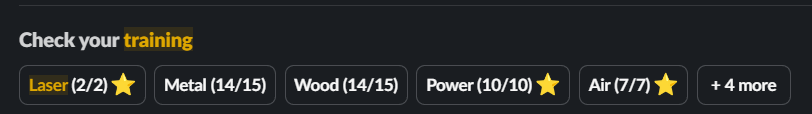
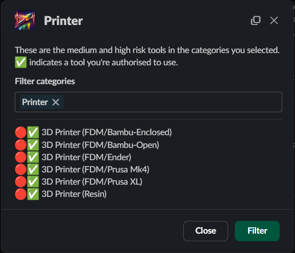
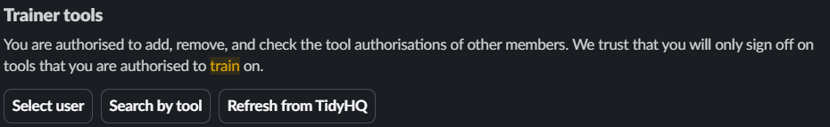
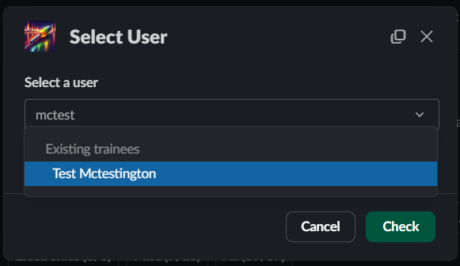
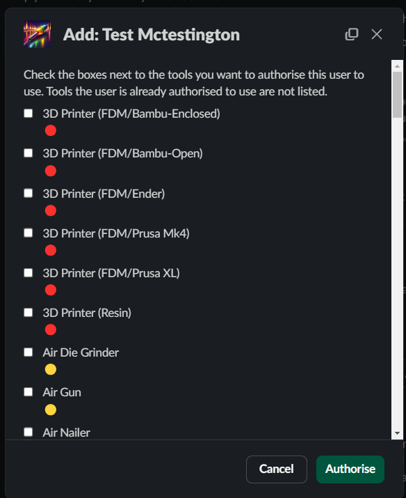
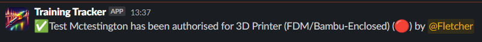

# trainingTracker

Track member tool/equipment inductions through Slack using TidyHQ as a backend.

## For users

* Provides information regarding the tool sign off process
* Check existing sign offs and information about machines not yet signed off
* Provides encouragement to learn new tools
* Increases awareness of available tools

## For trainers

* Check the sign offs for a particular user
* Find all users signed off on a particular tool
* Maintain contact list of authorised users for relevant notifications
* Refresh the list of tools and potential trainees from TidyHQ without leaving the app
* Add or remove authorisations for trainees in way that promotes group consensus amongst trainers

## For administrators

* Sign offs are stored as TidyHQ groups, no significant learning barrier to migrating in the future
* Trainer permissions are managed through Slack groups
* Includes configurable caching and processing offloading to allow for different usage levels and API limits

## Setup

* Ensure that TidyHQ credentials have been set in `config.json`
* `cp machines.json.example machines.json`
  * Configure at least one report. Report names should be alphanumeric.
  * Groups in TidyHQ that have a description set will be parsed for information. Each provided parameter should be on a new line and presented as `key=value`. Supported info is:
    * `url` = When this group appears as the header to a **report** column it will be linked to this page. No checking is done on the content of the field so it supports internal/external/relative/absolute links.
    * `level` = Included after the name of a group/tool if present. Field can include unicode characters eg 🔴🟡🟢. Within the Slack bot this will default to ⚪ if not specified.
    * `training` = Information regarding training. Displayed to a user checking their own sign offs via the Slack bot **if** they are not signed off on that tool.

## Markdown category output

Formats a markdown table of approved operators based on whether a contact is in a configured TidyHQ group.

Passing the special report name "all" will generate a report including a deduplicated list of all other reports. Specific groups can be excluded from this report by adding them to the special "exclude" category.

`markdown_report.py` will output a list of possible reports including their contents with human readable names rather than just IDs. The script will exit with an error code to catch it being executed without a report name accidentally in automations.

`markdown_report.py report_name` will output a markdown formatted table. It explicitly does not include a "generated on" line so that it doesn't trigger unnecessary page changes.

This can be used to push a report by:

* Cloning the wiki
* `sed -i '11,$ d' path/to/wiki_page` - Remove the contents of the page after the header (header is typically 10 lines)
* `python3 operator_report.py report_name >> path/to/wiki_page`
* Commit the changed file

## Statistics

`report.py` can be used to generate a number of useful statistics about overall training coverage

## Slack Bot

This bot includes various functions for users and trainers.

`./slack.py [-cv]`

* **-v** - Debug/verbose mode
* **-c** - Update all user homes, designed to be run as a cronjob to decrease loading times for new users

## Defining sign offs

Sign offs are defined purely through TidyHQ groups with group metadata stored in the group description. Each config parameter should be on it's own line with the format `key=value`. Use comma separated lists for keys that support multiple values.

* `categories` - Which categories the induction should show up under. The complete list of categories are built dynamically from these lists so try to avoid typos.
* `level` - Which level a tool is in. Despite appearances within the app probationary (🅿️) groups are not defined here. (Add a 🅿️ to the sign off name instead)
* `training` - A string detailing how to get training on a particular tool (typically when that process is different from normal). Only shown when the viewer does not have the sign off.
* `exclusive_with` - A list of sign off IDs that are incompatible with the current sign off. When **the current** sign off is added all sign offs specified here are removed. (Use this to automatically remove probationary sign offs when the full sign off is completed)
* `children` - When **the current** sign off is added also add the sign offs specified here.
* `first_use_check_in` - How many days after the sign off is complete should the bot check in with the user/trainer *(in progress)*
* `url` - Deprecated
